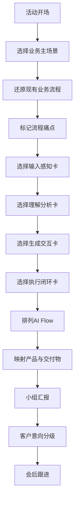
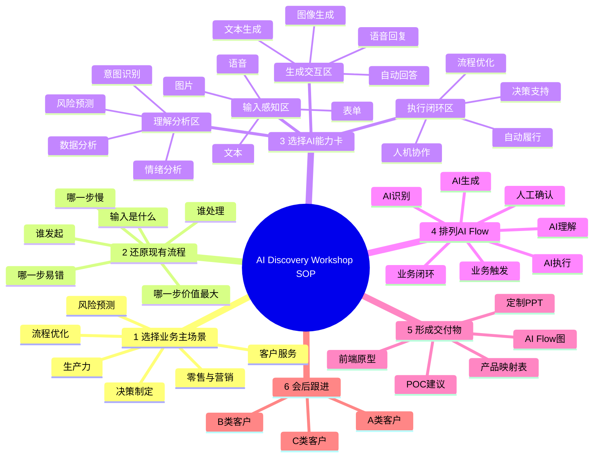

# AI Discovery Card Workshop 标准化 SOP 文档

基于“业务场景区 / 输入感知区 / 理解分析区 / 生成交互区 / 执行闭环区”的卡片推演流程。

## 一、文档目的

本 SOP 用于规范 AI Discovery Card Workshop 的现场执行流程，帮助客户在不需要提前理解全部 AI 技术和产品规则的情况下，通过卡片推演快速完成一个可落地的 AI 应用场景设计。

本 SOP 重点解决传统 AI Workshop 中的两个核心问题：

1. 信息密度失衡问题  
   通过“使用区”重新组织卡片，让客户每个阶段只关注当前需要的卡片，避免一次性阅读大量卡片导致信息过载。
2. 流程指引缺失问题  
   通过标准化推演路径，明确客户从“业务问题”到“AI Flow”再到“产品落地”的操作顺序，降低新参与者上手门槛。

## 二、Workshop 总体定位

### 2.1 活动定位

本活动不是传统产品宣讲，也不是单纯的技术培训，而是一个 AI 场景共创工作坊。

客户将在主持人引导下，通过卡片完成以下过程：

1. 选择业务场景
2. 还原现有流程
3. 识别痛点环节
4. 选择 AI 能力卡
5. 搭建 AI Flow
6. 映射产品能力
7. 生成可带走的方案交付物
8. 识别后续 POC 或合作机会

### 2.2 活动目标

> 暂时无法在飞书文档外展示此内容

## 三、适用场景

本 SOP 适用于以下类型活动：

> 暂时无法在飞书文档外展示此内容

## 四、参与角色与职责

### 4.1 主持人 / Facilitator

负责整体节奏控制、规则说明、客户引导和最终汇报组织。

主要职责：

- 介绍 Workshop 目标和玩法
- 引导客户按步骤使用卡片
- 控制时间节奏
- 帮助客户从业务问题转化为 AI Flow
- 避免客户陷入过早的产品细节讨论
- 引导每组完成最终汇报

### 4.2 技术顾问 / Solution Architect

负责技术解释、产品映射和可落地性判断。

主要职责：

- 解释卡片背后的 AI 能力
- 协助客户判断哪些能力适合当前场景
- 将卡片能力映射到 Microsoft / Azure / 合作伙伴产品
- 判断后续 POC 的技术可行性
- 记录客户的关键技术需求

### 4.3 业务顾问 / Account or Industry Lead

负责业务价值引导和商机识别。

主要职责：

- 引导客户聚焦业务痛点
- 帮助客户明确价值指标
- 判断客户意向强弱
- 识别后续跟进机会
- 会后推动客户拜访、方案会或 POC

### 4.4 客户参与者

建议每组 4–6 人，最好包含以下角色：

> 暂时无法在飞书文档外展示此内容

## 五、现场物料准备

### 5.1 必备物料

> 暂时无法在飞书文档外展示此内容

### 5.2 卡片摆放方式

不建议按照原始分类直接平铺所有卡片，而是按照现场推演逻辑分为五个使用区。

## 六、卡片使用区定义

### 6.1 使用区总览

> 暂时无法在飞书文档外展示此内容

## 七、五个使用区详细说明

### 7.1 业务场景区

**作用**  
帮助客户先确定业务方向，不让客户一开始陷入具体技术功能。

**适合放入的卡片类型**

- 智能体类卡片
- 数据和预测分析中偏业务目标的卡片
- 内容生成中偏营销、网页、内容生产的卡片

**典型卡片示例**

> 暂时无法在飞书文档外展示此内容

**引导问题**

主持人可以这样问：

- 你们当前最希望 AI 帮助改善哪类业务？
- 是提升客户体验？
- 提升销售转化？
- 提高运营效率？
- 降低风险？
- 还是帮助员工更高效地完成工作？

### 7.2 输入感知区

**作用**  
帮助客户明确 AI 从哪里获取信息。

**适合放入的卡片类型**

- 视觉感知
- 语音识别
- 图像识别
- OCR
- 表单理解
- 环境感知

**典型卡片示例**

> 暂时无法在飞书文档外展示此内容

**引导问题**

- 这个业务流程里，AI 首先需要看到、听到、读到什么？
- 是客户的语音？
- 是合同、票据或表单？
- 是图片或现场设备？
- 还是系统中的文本和历史记录？

### 7.3 理解分析区

**作用**  
帮助客户明确 AI 如何理解输入内容，并形成判断。

**适合放入的卡片类型**

- 文本理解
- 情绪分析
- 用户意图识别
- 数据分析
- 风险预测
- 异常检测
- 客户洞察

**典型卡片示例**

> 暂时无法在飞书文档外展示此内容

**引导问题**

- AI 拿到这些信息之后，需要判断什么？
- 它要判断客户意图？
- 判断风险？
- 判断优先级？
- 判断情绪？
- 还是从数据中发现趋势和异常？

### 7.4 生成交互区

**作用**  
帮助客户明确 AI 输出什么内容，以及如何与用户交互。

**适合放入的卡片类型**

- 自动回答
- 自然对话
- 文本生成
- 图像生成
- 语音合成
- 翻译
- 网页生成
- 营销内容生成

**典型卡片示例**

> 暂时无法在飞书文档外展示此内容

**引导问题**

- AI 最终要给用户输出什么？
- 是一段回答？
- 一份报告？
- 一个营销内容？
- 一个网页原型？
- 一个语音回复？
- 还是一份管理层可以看的分析结果？

### 7.5 执行闭环区

**作用**  
帮助客户思考 AI 如何不止停留在“建议”，而是推动业务流程完成。

**适合放入的卡片类型**

- 智能体
- 流程优化
- 自动履行
- 路径规划
- 人机交互
- 生产力
- 安全运营
- 决策制定

**典型卡片示例**

> 暂时无法在飞书文档外展示此内容

**引导问题**

- AI 输出结果之后，业务流程是否继续往下走？
- 是否需要自动创建工单？
- 是否需要提醒人工介入？
- 是否需要生成报告？
- 是否需要触发审批、派单、推荐或后续跟进？

## 八、Workshop 标准流程

### 阶段 0：活动开场

**8.1 目标**  
让客户理解本次活动的玩法和产出，降低参与压力。

**8.2 时间**  
3–5 分钟。

**8.3 主持人话术**

今天这场活动不是让大家学习所有 AI 技术，也不是要求大家马上决定采购什么产品。

我们会通过一组 AI Discovery Cards，一步一步完成一个 AI 应用场景设计。

大家只需要按照流程：

1. 先选业务问题
2. 再画现有流程
3. 然后选择合适的 AI 能力
4. 最后把这些能力串成一个 AI Flow

活动结束时，每组会形成一个可以带回公司内部讨论的 AI 场景方案。

**8.4 强调规则**

主持人需要强调三条原则：

1. 第一，先谈业务，不先谈产品。
2. 第二，先搭流程，不先堆功能。
3. 第三，最后一定要形成可讲清楚的 AI Flow。

### 阶段 1：选择业务主场景

**8.5 目标**  
帮助客户确定本次推演要解决的业务问题。

**8.6 时间**  
10 分钟。

**8.7 使用卡片**

只使用：

- 业务场景区卡片

暂时不使用其他卡片。

**8.8 操作步骤**

1. Step 1：每组浏览业务场景区卡片  
   主持人提示客户：现在先不要看所有卡片，只看业务场景区。请每组选出一个你们最想解决的业务场景。
2. Step 2：每组选 1 张主场景卡  
   要求：
   - 必须选择 1 张主场景卡
   - 最多可选择 1 张辅助场景卡
   - 不建议一开始选择超过 2 张场景卡
3. Step 3：填写一句话场景定义

**模板：**

> 我们要为【目标用户/部门】解决【具体业务问题】，  
> 希望通过 AI 实现【业务改善目标】。

**8.9 示例**

> 我们要为客服团队解决客户咨询响应慢、重复问题处理成本高的问题，  
> 希望通过 AI 实现自动识别客户意图、自动回答常见问题，并提高人工客服处理效率。

**8.10 阶段产出**

> 暂时无法在飞书文档外展示此内容

### 阶段 2：还原现有业务流程

**8.11 目标**  
让客户把真实业务流程说清楚，找到 AI 应该介入的位置。

**8.12 时间**  
10–15 分钟。

**8.13 使用卡片**

此阶段可以暂时不使用新卡片，只围绕阶段 1 选出的业务场景卡展开。

**8.14 操作步骤**

1. Step 1：画出现有流程

   **模板：**

   1. 业务触发
   2. 信息输入
   3. 人工处理
   4. 系统处理
   5. 结果输出
   6. 后续跟进

2. Step 2：标记痛点  
   每组用便利贴标记流程中的痛点。痛点类型可以包括：

   > 暂时无法在飞书文档外展示此内容

3. Step 3：选择最值得 AI 改造的 1–3 个环节  
   主持人提醒：不要试图一次性改造整个流程。请先找出最值得 AI 介入的 1 到 3 个关键环节。

**8.15 引导问题**

- 这个流程从哪里开始？
- 谁发起？
- 输入是什么？
- 谁负责处理？
- 哪一步最慢？
- 哪一步最依赖人工经验？
- 哪一步最容易出错？
- 哪一步客户体验最差？
- 哪一步如果被 AI 改造，价值最大？

**8.16 阶段产出**

> 暂时无法在飞书文档外展示此内容

### 阶段 3：选择 AI 能力卡

**8.17 目标**  
围绕现有流程中的痛点，选择适合的 AI 能力卡。

**8.18 时间**  
20–25 分钟。

**8.19 使用卡片**

依次使用：

1. 输入感知区
2. 理解分析区
3. 生成交互区
4. 执行闭环区

**8.20 操作原则**

客户不是随意挑卡，而是根据流程问题逐步选卡。

推荐顺序：

1. AI 需要接收什么？
2. AI 需要理解什么？
3. AI 需要生成什么？
4. AI 需要推动什么？

#### 8.21 Step 1：选择输入感知类卡片

**目标**  
明确 AI 需要从哪些来源获取信息。

**引导问题**  
AI 首先要处理什么输入？是文字、语音、图片、表单、视频，还是系统数据？

**示例选择**

> 暂时无法在飞书文档外展示此内容

#### 8.22 Step 2：选择理解分析类卡片

**目标**  
明确 AI 如何理解输入内容，并形成判断。

**引导问题**  
AI 获取信息之后，需要判断什么？它要判断客户是谁、想做什么、情绪如何、是否有风险，还是要发现数据里的趋势？

**示例选择**

> 暂时无法在飞书文档外展示此内容

#### 8.23 Step 3：选择生成交互类卡片

**目标**  
明确 AI 输出什么内容，如何与用户交互。

**引导问题**  
AI 需要生成什么结果？是一段回答、一份总结、一张图、一份报告、一个网页，还是一个语音回复？

**示例选择**

> 暂时无法在飞书文档外展示此内容

#### 8.24 Step 4：选择执行闭环类卡片

**目标**  
明确 AI 输出后如何推动业务完成。

**引导问题**  
AI 给出结果之后，下一步是什么？是自动派单、自动生成任务、提醒人工介入、触发审批，还是形成经营分析报告？

**示例选择**

> 暂时无法在飞书文档外展示此内容

**8.25 阶段产出**

> 暂时无法在飞书文档外展示此内容

### 阶段 4：排列 AI Flow

**8.26 目标**  
把选中的卡片从“能力集合”变成一条完整的 AI 应用流程。

**8.27 时间**  
15–20 分钟。

**8.28 使用卡片**

使用阶段 1 和阶段 3 已经选出的所有卡片。

**8.29 标准 AI Flow 结构**

建议客户按照以下结构排列：

1. 业务触发
2. 数据 / 内容输入
3. AI 识别
4. AI 理解
5. AI 生成
6. AI 执行 / 推荐
7. 人工确认
8. 业务闭环

**8.30 现场填写模板**

> 当【用户/员工/客户】发生【业务动作】时，  
> 系统通过【输入感知类 AI 能力】获取信息，  
> 再通过【理解分析类 AI 能力】判断问题、需求或风险，  
> 然后通过【生成交互类 AI 能力】生成回复、内容、方案或报告，  
> 最后通过【执行闭环类 AI 能力】推动业务流程完成，  
> 并将结果沉淀为【数据、报告、任务或后续商机】。

**8.31 示例：客户服务 AI Flow**

1. 客户通过电话或网页提交问题
2. AI 将语音转换为文本，或读取客户输入内容
3. AI 识别客户意图，并分析客户情绪
4. AI 自动生成回复，并进行自然对话
5. 复杂问题自动升级人工客服或专家
6. 系统汇总客户问题和处理结果
7. 生成客户服务优化报告

**8.32 示例：销售营销 AI Flow**

1. 销售团队导入客户数据和历史互动记录
2. AI 分析客户行为和兴趣偏好
3. AI 识别高潜客户和流失风险客户
4. AI 自动生成个性化营销内容
5. 销售人员确认并发送营销信息
6. 系统追踪转化结果
7. AI 生成下一轮营销优化建议

**8.33 示例：表单处理 AI Flow**

1. 客户上传合同、订单或票据
2. AI 识别和理解表单内容
3. AI 提取关键字段并检查缺失信息
4. AI 判断是否存在异常或风险
5. 系统自动生成处理建议
6. 人工确认后进入审批或归档流程
7. 形成结构化数据和处理记录

**8.34 阶段产出**

> 暂时无法在飞书文档外展示此内容

### 阶段 5：产品与交付物映射

**8.35 目标**  
将 AI Flow 中的能力卡与具体产品、原型和后续 POC 方向连接起来。

**8.36 时间**  
15 分钟。

**8.37 使用卡片**

查看每张卡片中的：

- 描述
- 详细说明
- 涉及产品

**8.38 操作步骤**

1. Step 1：逐张查看已选卡片的产品字段  
   不要查看全部卡片，只查看本组已经选中的卡片。
2. Step 2：填写产品映射表

   **模板：**

   > 暂时无法在飞书文档外展示此内容

**8.39 示例：客户服务场景产品映射**

> 暂时无法在飞书文档外展示此内容

**8.40 阶段产出**

> 暂时无法在飞书文档外展示此内容

### 阶段 6：小组汇报

**8.41 目标**  
让每组把 AI 场景方案讲清楚，并帮助主持人与销售团队识别后续机会。

**8.42 时间**  
每组 3–5 分钟。

**8.43 汇报结构**

每组按照以下顺序汇报：

1. 我们选择的业务场景是什么？
2. 当前流程中最大的问题是什么？
3. AI 介入了哪些环节？
4. 我们的 AI Flow 是什么？
5. 使用了哪些产品或能力？
6. 现场可以看到什么交付物？
7. 后续如果做 POC，应该验证什么？

**8.44 汇报模板**

> 我们选择的场景是【场景名称】。  
> 当前主要问题是【业务痛点】。  
> 我们设计的 AI Flow 是：首先【输入环节】，然后【理解分析环节】，接着【生成交互环节】，最后【执行闭环环节】。  
> 这个方案可以帮助客户实现【业务价值】。  
> 现场可以形成【原型 / PPT / 流程图 / 分析结果】。  
> 如果后续推进 POC，我们建议优先验证【POC 范围】。

**8.45 主持人点评维度**

> 暂时无法在飞书文档外展示此内容

### 阶段 7：客户意向分级与会后跟进

**8.46 目标**  
避免活动结束后只收集联系方式，而是形成明确的后续跟进机制。

**8.47 时间**  
5–10 分钟。

**8.48 客户分级标准**

> 暂时无法在飞书文档外展示此内容

**8.49 会后跟进机制**

**A 类客户**  
建议动作：

1. 现场确认联系人
2. 会后发送定制 PPT 和 AI Flow
3. 安排业务与技术深度访谈
4. 明确 POC 范围
5. 输出 POC 方案和报价

**B 类客户**  
建议动作：

1. 发送活动总结和行业案例
2. 邀请参加下一场行业专场
3. 安排一次线上需求梳理
4. 判断是否升级为 A 类机会

**C 类客户**  
建议动作：

1. 发送通用资料
2. 保持市场触达
3. 邀请后续活动
4. 等待更明确业务需求

## 九、现场时间安排建议

### 9.1 标准版：2 小时

> 暂时无法在飞书文档外展示此内容

### 9.2 精简版：60 分钟

> 暂时无法在飞书文档外展示此内容

### 9.3 深度版：半天

> 暂时无法在飞书文档外展示此内容

## 十、主持人关键话术

### 10.1 开场话术

> 今天我们不要求大家先理解所有 AI 技术。  
> 我们会从业务问题开始，通过卡片一步一步搭建 AI 场景。  
> 卡片不是答案，而是帮助大家讨论的工具。  
> 最终目标不是选最多的卡，而是形成一条清晰、可落地、可讲给企业内部听的 AI Flow。

### 10.2 防止客户陷入产品细节的话术

> 这个问题我们后面会回到产品和技术实现。  
> 现在先不讨论具体产品选型，我们先确认这个业务流程是否值得被 AI 改造。

### 10.3 防止客户选太多卡的话术

> 不是卡片越多方案越完整。  
> 我们建议每个场景先控制在 5 到 8 张关键卡片。  
> 只保留能支撑 AI Flow 的卡，不能放进流程里的卡先拿掉。

### 10.4 引导客户从技术回到业务价值的话术

> 这张卡代表一种 AI 能力。  
> 我们需要进一步回答：它能帮业务减少什么成本、提高什么效率、改善什么体验，或者带来什么新的收入机会？

### 10.5 引导客户形成 POC 的话术

> 如果我们不一次性做完整系统，而是先做一个小范围 POC，  
> 你们认为最值得验证的是哪一个环节？  
> 是识别准确率？  
> 是自动回复效果？  
> 是流程自动化？  
> 还是业务人员是否愿意使用？

## 十一、客户快速上手说明卡

建议现场给每位客户一张简化版说明。

### AI Discovery Card 快速上手卡

#### 第一步：先选业务问题

从“业务场景区”选 1 张主场景卡。

回答：

> 我们要解决谁的什么问题？

#### 第二步：画出现有流程

不要急着选技术，先画当前流程。

回答：

> 现在这个问题是怎么被处理的？

#### 第三步：找到痛点

标记流程中最慢、最重复、最容易出错、最影响体验的环节。

回答：

> 哪一步最值得 AI 改造？

#### 第四步：选择 AI 能力卡

按照顺序选卡：

- 输入感知区：AI 接收什么？
- 理解分析区：AI 判断什么？
- 生成交互区：AI 输出什么？
- 执行闭环区：AI 推动什么？

#### 第五步：排列 AI Flow

把卡片排成一条流程：

> 业务触发 → 输入 → 理解 → 生成 → 执行 → 闭环

#### 第六步：补充产品和交付物

回答：

- 这个方案可以用哪些产品实现？
- 现场能生成什么原型或 PPT？
- 后续 POC 验证什么？

## 十二、最终交付物要求

每组活动结束时，建议至少形成以下 5 类交付物。

> 暂时无法在飞书文档外展示此内容

## 十三、AI Flow 标准模板

可作为现场填写模板。

**场景名称：**  
【填写业务场景】

**目标用户：**  
【填写客户、员工、运营人员、销售人员等】

**当前问题：**  
【填写当前流程中的痛点】

**现有流程：**

1. 【步骤一】
2. 【步骤二】
3. 【步骤三】
4. 【步骤四】

**AI 改造流程：**

1. 【业务触发】
2. 【输入感知】
3. 【理解分析】
4. 【生成交互】
5. 【执行闭环】
6. 【结果沉淀】

**使用卡片：**

- 业务场景卡： 【填写】
- 输入感知卡： 【填写】
- 理解分析卡： 【填写】
- 生成交互卡： 【填写】
- 执行闭环卡： 【填写】

**对应产品：**  
【填写】

**现场交付物：**  
【填写】

**后续 POC 方向：**  
【填写】

## 十四、完整案例示范

### 案例：智能客户服务场景

#### 14.1 场景定义

> 我们要为客服团队解决客户咨询响应慢、重复问题处理成本高、复杂问题升级不及时的问题，  
> 希望通过 AI 实现自动识别客户意图、自动回答常见问题，并提升人工客服处理效率。

#### 14.2 现状流程

1. 客户提交问题
2. 客服人工阅读问题
3. 客服查询知识库
4. 人工组织回复
5. 客户继续追问
6. 客服升级专家
7. 专家处理后反馈
8. 客服手动记录结果

#### 14.3 现状痛点

> 暂时无法在飞书文档外展示此内容

#### 14.4 选择卡片

> 暂时无法在飞书文档外展示此内容

#### 14.5 AI Flow

1. 客户通过电话、网页或聊天窗口提交问题
2. AI 读取文本或将语音转换为文本
3. AI 识别客户意图并分析情绪
4. AI 查询知识库并生成自动回答
5. AI 与客户进行自然对话
6. 复杂问题自动升级人工客服或专家
7. 系统记录处理过程和客户反馈
8. AI 汇总问题类型、满意度和高频问题
9. 生成客户服务优化报告

#### 14.6 产品映射

> 暂时无法在飞书文档外展示此内容

#### 14.7 POC 建议

建议优先验证：

1. 客户问题识别准确率
2. 知识库问答命中率
3. 常见问题自动回复效果
4. 复杂问题升级规则
5. 客服管理报表是否能支持业务决策

## 十五、评估与打分表

为了提高现场参与感，可以让每组方案进行简单评分。

> 暂时无法在飞书文档外展示此内容

## 十六、会后输出材料

活动结束后，建议给客户输出一份定制化材料。

### 16.1 客户版交付内容

> 暂时无法在飞书文档外展示此内容

### 16.2 内部销售版记录内容

> 暂时无法在飞书文档外展示此内容

## 十七、注意事项

### 17.1 不要一开始介绍所有卡片

**错误方式：**

> 我们先把每张卡都讲一遍。

**推荐方式：**

> 大家不用先理解所有卡片。  
> 每个阶段只看对应区域的卡片。

### 17.2 不要让客户从产品开始选

**错误方式：**

> 你们想用 Azure OpenAI 还是 Power Platform？

**推荐方式：**

> 你们当前最想改善哪一个业务流程？

### 17.3 不要让客户选太多卡

**错误方式：**

> 这些卡都很有用，我们都放进去。

**推荐方式：**

> 只保留能放进 AI Flow 的卡。  
> 如果这张卡不能解释它在流程中的作用，就先拿掉。

### 17.4 不要只停留在灵感讨论

**错误方式：**

> 这个想法不错，后面可以看看。

**推荐方式：**

> 我们把它落到流程里：  
> 它发生在哪一步？  
> 输入是什么？  
> 输出是什么？  
> 谁来确认？  
> 最后如何闭环？

### 17.5 不要忽略后续跟进

**错误方式：**

> 活动结束后收个名片就结束。

**推荐方式：**

> 每组结束后都要判断：  
> 这个场景是否适合 POC？  
> 客户是否有负责人？  
> 数据是否可获得？  
> 下一步是否可以安排深度交流？

## 十八、推荐最终流程图

## 十九、推荐现场思维导图

## 二十、SOP 总结

本 SOP 的核心不是减少卡片数量，而是通过“使用区 + 阶段化流程”降低客户理解成本。

客户不需要一开始看懂所有卡片，只需要按照以下路径完成推演：

1. 先选业务场景
2. 再画现有流程
3. 然后找痛点
4. 接着选 AI 能力卡
5. 再排列 AI Flow
6. 最后映射产品和 POC

最终，Workshop 应形成三类价值：

> 暂时无法在飞书文档外展示此内容

这套 SOP 可以作为后续所有 AI Discovery Card Workshop 的标准执行手册。