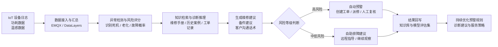

# AI Flow 假设图

适用场景：设备运行异常预警、故障诊断与维修建议。

```mermaid
flowchart LR
    A[IoT 设备日志\n功耗数据\n温感数据] --> B[数据接入与汇总\nEMQX / DataLayers]
    B --> C[异常检测与风险评分\n识别死机 / 老化 / 故障概率]
    C --> D[知识检索与诊断推理\n维修手册 / 历史案例 / 工单记录]
    D --> E[生成维修建议\n备件建议\n客户沟通话术]
    E --> F{风险等级判断}
    F -->|高风险| G[自动预警\n创建工单 / 派修 / 人工复核]
    F -->|中低风险| H[自助排障建议\n远程指导 / 继续观察]
    G --> I[结果回写\n知识库与模型评估集]
    H --> I
    I --> J[持续优化预警规则\n诊断建议与服务策略]
```

建议在 PPT 中把这张图放在 AI Flow 页或解决方案架构页之前，用来承接“痛点 -> 目标流程 -> 架构落地”的叙事。